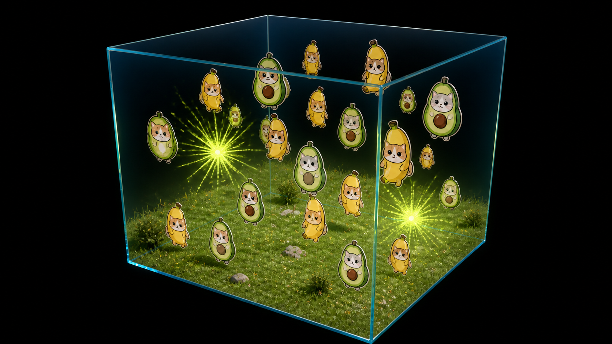

# FruitCat Chaos 3D — Purrallel Arena

> Propuesta conceptual para el Proyecto 1 de Computación Paralela y Distribuida.

## Idea general

**FruitCat Chaos 3D** es un *screensaver* 3D en C++ que muestra `N` gatos disfrazados de fruta flotando dentro de una arena transparente. Los gatos se desplazan en las tres dimensiones, rebotan contra las paredes de la arena y colisionan entre sí. Cada choque produce una explosión breve de partículas de colores asociados a las frutas.

La experiencia se observa mediante una cámara que gira continuamente alrededor de la arena, por lo que el programa se comporta como un *screensaver*: no necesita un objetivo de juego, menús ni controles complejos.

El proyecto contará con una versión secuencial y otra paralela usando **OpenMP**. OpenGL se utilizará únicamente para el renderizado, mientras que OpenMP acelerará los cálculos de simulación.

## Referencia visual



La imagen es la referencia estética principal: una arena de vidrio iluminada que flota en un vacío negro. El terreno, los gatos y las explosiones existen dentro de la caja; fuera de ella no hay escenario. La versión del programa utilizará modelos simples, *billboards* o sprites propios; no busca copiar la imagen ni depender de ella durante la ejecución.

## Escena 3D propuesta

La escena tendrá los siguientes componentes:

- **Terreno interno:** plataforma verde simple dentro de la arena, con una ligera textura o variación de color.
- **Vacío exterior:** fondo negro absoluto fuera de la caja, para aislar visualmente la simulación.
- **Arena transparente:** caja de vidrio con seis límites físicos. Es el único volumen visible donde permanecen los gatos.
- **Gatos-fruta:** objetos que flotan, cambian ligeramente de orientación y varían en escala para dar una sensación más orgánica.
- **Explosiones:** destellos y partículas de fruta al ocurrir una colisión.
- **Cámara orbitante:** recorre un círculo alrededor de la arena y siempre apunta hacia su centro.
- **Panel mínimo:** contador de FPS y datos de ejecución como cantidad de gatos e hilos.

## Cámara flotante

La cámara tendrá movimiento orbital constante. Su posición se calcula a partir del tiempo y del radio de órbita; siempre mira hacia el centro de la arena. Esto añade un elemento claro de trigonometría al proyecto y hace visible el movimiento en las tres dimensiones.

Conceptualmente:

```text
La cámara gira alrededor de la arena
          ↓
observa los gatos desde ángulos distintos
          ↓
la cámara apunta siempre al centro
```

La cámara no modifica la simulación física: solo cambia cómo se observa. Su velocidad y distancia podrán parametrizarse más adelante.

## Array principal de objetos

El conjunto central de datos será un arreglo contiguo de `N` gatos. Cada posición representa un objeto independiente dentro de la simulación.

```cpp
std::vector<FruitCat> cats;
// cats.size() == N
```

Usar un arreglo/vector facilita repartir rangos de índices entre los hilos de OpenMP. Por ejemplo, un hilo puede actualizar los gatos `0–249`, otro `250–499`, y así sucesivamente.

### Estructura conceptual de un gato-fruta

```cpp
enum class FruitType {
    Banana,
    Avocado
};

struct Vec3 {
    float x;
    float y;
    float z;
};

struct FruitCat {
    int id;
    FruitType fruitType;

    Vec3 position;
    Vec3 velocity;

    float radius;
    float scale;
    float rotation;
    float rotationSpeed;

    bool isExploding;
    float explosionCooldown;
    int appearanceIndex;
};
```

| Grupo de datos | Propósito |
|---|---|
| `id` y `fruitType` | Identifican al gato y determinan el estilo de la explosión. |
| `position` | Ubicación tridimensional dentro de la caja. |
| `velocity` | Dirección y rapidez en los ejes `x`, `y` y `z`. |
| `radius` | Tamaño físico usado para detectar choques. |
| `scale`, `rotation`, `rotationSpeed` | Apariencia visual y movimiento secundario. |
| Estado de explosión | Evita que el mismo choque produzca explosiones en cada frame. |
| `appearanceIndex` | Permite seleccionar una variante visual del gato. |

## Sistema de partículas

Las explosiones se representarán mediante un segundo arreglo de partículas reutilizables. Las partículas no son gatos: son efectos visuales de vida corta.

```cpp
std::vector<Particle> particles;
```

Cada partícula almacenará posición, velocidad, color, tamaño, opacidad, vida restante y estado activo. Al terminar su vida vuelve a estar disponible para una explosión futura. Este diseño evita crear y destruir memoria continuamente durante la animación.

Las explosiones seguirán esta identidad visual:

- Banana + Banana: amarillo, dorado y naranja.
- Avocado + Avocado: verde lima, verde claro y verde oscuro.
- Banana + Avocado: combinación amarillo-verde.

## Patrón de movimiento

Cada gato inicia con posición, dirección, velocidad, rotación y tipo de fruta pseudoaleatorios. Durante cada frame sigue este ciclo general:

```text
Posición actual
      ↓
Aplicar velocidad según el tiempo transcurrido
      ↓
Actualizar orientación y escala visual
      ↓
Comprobar las seis paredes de la arena
      ↓
Rebotar si alcanzó un límite
      ↓
Continuar hacia el siguiente frame
```

El movimiento se realiza en `x`, `y` y `z`, no solamente sobre el terreno. Al tocar una pared de la caja se invierte la componente de velocidad correspondiente, produciendo un rebote predecible y visualmente claro.

El terreno es decorativo; los gatos pueden flotar por toda la arena. Esto evita mezclar una simulación de gravedad compleja con los objetivos principales de paralelización.

## Modelo de colisión

Cada gato se aproximará mediante una esfera cuyo tamaño depende de su radio. Dos gatos colisionan cuando la distancia entre sus centros es menor o igual que la suma de sus radios.

```text
Centro A ●──── distancia ────● Centro B

Si la distancia es menor que radioA + radioB,
existe una colisión.
```

Cuando ocurre una colisión, a nivel conceptual suceden cuatro acciones:

1. Se registra un evento que identifica a ambos gatos y el punto de impacto.
2. Se corrige ligeramente su posición para que no permanezcan superpuestos.
3. Se modifica su dirección de movimiento para simular el rebote.
4. Se activa una explosión de partículas con la paleta correspondiente.

Los eventos de colisión se guardarán separados de la modificación directa de los objetos. Esto es importante para que varios hilos no intenten alterar el mismo gato o reservar las mismas partículas al mismo tiempo.

## Diseño paralelo con OpenMP

El patrón principal será **paralelismo de datos**: todos los gatos realizan las mismas operaciones, pero cada hilo procesa un rango distinto del arreglo.

```text
Arreglo de gatos: [ 0 ... N - 1 ]
                       │
       ┌───────────────┼───────────────┐
       ↓               ↓               ↓
    Hilo 0          Hilo 1          Hilo 2 ...
 actualiza       actualiza       actualiza
 un rango         un rango         un rango
```

Las fases de un frame serán:

1. El hilo principal recibe eventos y calcula el tiempo del frame.
2. OpenMP actualiza en paralelo posiciones, rotación y rebotes contra paredes.
3. Se sincroniza el estado de los gatos.
4. OpenMP detecta colisiones y guarda eventos por hilo.
5. El hilo principal combina los eventos y aplica sus efectos de manera segura.
6. OpenMP actualiza en paralelo las partículas activas.
7. El hilo principal renderiza toda la escena con OpenGL.
8. Se calcula y se muestra el FPS.

El renderizado permanece en el hilo principal porque el contexto de OpenGL normalmente no se debe compartir libremente entre hilos. La ganancia de OpenMP provendrá de la física, las colisiones y las partículas, que son las tareas de cálculo más repetitivas.

## PCAM a gran escala

| Etapa | Aplicación en FruitCat Chaos |
|---|---|
| **Partición** | Dividir el arreglo de gatos y el arreglo de partículas en rangos de índices. |
| **Comunicación** | Usar eventos de colisión y una sincronización entre fases para compartir resultados sin modificar objetos simultáneamente. |
| **Aglomeración** | Cada hilo procesa bloques de objetos, no una tarea individual por gato. |
| **Mapeo** | OpenMP asigna los bloques a los núcleos disponibles mediante planificación estática como punto de partida. |

## Versiones a comparar

La versión secuencial y la paralela deben conservar el mismo comportamiento visual y el mismo conjunto inicial de datos. La diferencia estará solo en cómo se distribuyen los cálculos internos.

| Versión | Actualización de gatos | Colisiones | Partículas | Renderizado |
|---|---|---|---|---|
| Secuencial | Un gato a la vez | Un proceso | Una partícula a la vez | Hilo principal |
| Paralela | Rangos con OpenMP | Detección repartida y eventos seguros | Rangos con OpenMP | Hilo principal |

Las mediciones utilizarán distintos valores de `N` y distintas cantidades de hilos. Se registrarán al menos tiempo de frame, FPS promedio, *speedup* y eficiencia.

```text
speedup = tiempo secuencial / tiempo paralelo
eficiencia = speedup / número de hilos
```

## Parámetros previstos

El programa deberá recibir como mínimo `N`, la cantidad de gatos. Más adelante podrá aceptar también el número de hilos, dimensiones de la ventana y un modo de ejecución.

```text
fruitcat-chaos <N> [hilos] [ancho] [alto] [modo]
```

Ejemplo conceptual:

```text
fruitcat-chaos 1000 4 1280 720 parallel
```

El programa validará que los parámetros sean números válidos, positivos y apropiados para la memoria y la ventana solicitada.

## Alcance inicial

La primera versión funcional se enfocará en lo que permite demostrar correctamente la física y la paralelización:

- Arena transparente, terreno y cámara orbitante.
- Dos tipos de gatos-fruta.
- Movimiento 3D y rebote contra las paredes.
- Colisiones esféricas y explosiones de partículas.
- FPS visible.
- Modo secuencial y modo paralelo con OpenMP.
- Mediciones de desempeño y cálculo de speedup/eficiencia.

Fuera del alcance inicial quedan modelos 3D complejos, física realista, sonido, redes, IA, menús de juego y efectos de iluminación avanzados. Se podrán agregar después solo si la simulación, la versión paralela y las mediciones ya están completas.
cuantas 